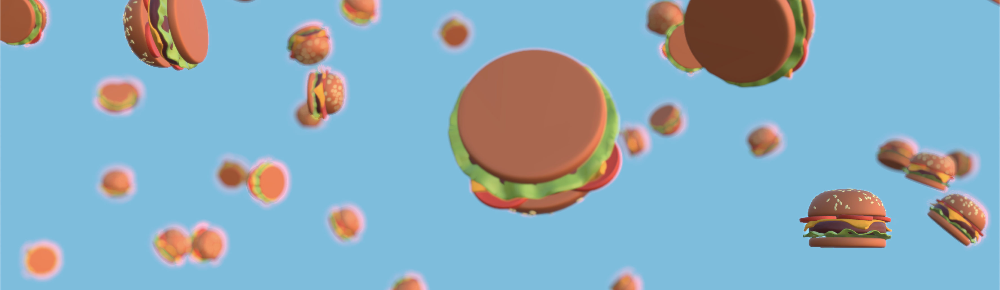

# Raining Hamburgers

<p align="center">
  
</p>

<br />

<div align="center"><strong>Raining Hamburgers</strong></div>
<div align="center">A study project to deal with 3D objects, movements, rotations and post processing effects.</div>

<br />

<div align="center">
  <sub>Created by <a href="https://www.instagram.com/igabrieldejesus">Gabriel de Jesus</a>.</sub>
</div>

<br />

## ✨ Features

- ⚡️ Vite
- ⚛️ React 18
- 🧑🏾‍🎨 Three.js

## 🚀 Quick Start

**Clone repository**

```bash
git clone https://github.com/gabrieldejesus/raining-hamburgers
```

```bash
cd raining-hamburgers
```

**Install dependencies**

```bash
npm install
```

## 🦾 Development

To start the project locally on development, run:

```bash
npm run dev
```

Open <a href="http://localhost:5173">http://localhost:5173</a> with your client to see the result.

## 📜 Documentation

### 🚨 Requirements

- Node.js >= 16

### 🗂️ Directory Structure

- [`public`](./public) — Static assets such as images, and others files.<br>
- [`src`](./src) — Application source code, including pages, scenes and styles.

### 🦾 Scripts

- `npm run dev` — Starts the application in development mode at `http://localhost:5173`.
- `npm run build` — Creates an optimized production build of your application.
- `npm run preview` — Preview the application in production mode.
- `npm run lint` — Runs ESLint for all files in the `src` directory.

## 🐞 Bugs, help, issues or new updates

If you need any help tu run this app or want to make new updates just contact me at: <a href="mailto:hi@gabrieldejesus.dev">hi@gabrieldejesus.dev</a>
